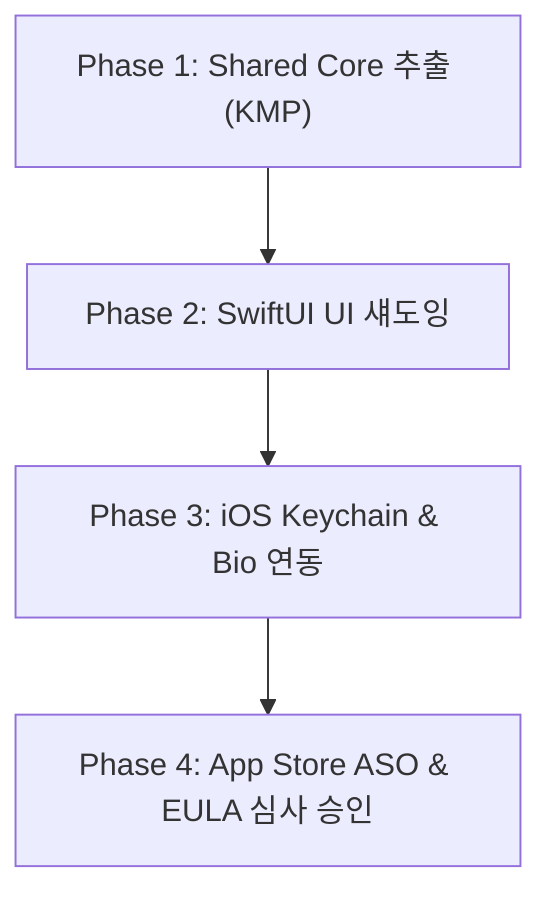

# 📱 InsightDeal iOS Migration & SwiftUI Bridge Architecture Spec

이 문서는 **InsightDeal** 안드로이드(Jetpack Compose + MVVM) 버전의 대성공적인 스토어 출시 이후, 글로벌 런칭 성과를 극대화하기 위해 **SwiftUI 브릿지 버전 또는 Compose Multiplatform(KMP)**으로 점진적 포팅 및 런칭을 완료하기 위한 핵심 기술 명세서입니다.

---

## 📅 iOS 출시 핵심 마일스톤 (Milestone)

### 📌 Phase 1: Shared Core & Data Layer 추출
* **목적**: Kotlin으로 구현된 로컬 Room DB, Retrofit 네트워크 레포지토리, 암호화 Preference 비즈니스 로직을 `KMP (Kotlin Multiplatform)` 모듈로 공유화하여 중복 개발 공수를 90% 이상 제거합니다.
* **대상 패키지**:
  * `com.ddaeany0919.insightdeal.data.**`
  * `com.ddaeany0919.insightdeal.network.**`
* **조치 사항**:
  * `Room` 라이브러리를 KMP용 `Kstore` 혹은 `SQLDelight`로 전환.
  * `Retrofit`을 멀티플랫폼 표준 HTTP 클라이언트인 `Ktor`로 선제 리팩토링.

### 📌 Phase 2: SwiftUI 기반 Toss 스타일 극미니멀 UI 브릿징
안드로이드의 Jetpack Compose(Material 3)의 우아하고 플랫한 토스 감성 그레이 콤팩트 카드를 iOS SwiftUI로 100% 싱크로율 이식합니다.

* **UI 컴포넌트 맵**:
  * `WishlistScreen.kt` ➡️ `WatchlistView.swift` (미니멀 찜 목록)
  * `StandardWishlistCard.kt` ➡️ `WatchlistCardView.swift` (찜 카드)
  * `BrandPlaceholder` (ㅠㅠ 슬픈 주황 불꽃 캐릭터) ➡️ `BrandPlaceholderView.swift`
* **SwiftUI 햅틱 피드백 이식**:
  * 안드로이드의 `bounceClick` 모디파이어를 SwiftUI의 `.scaleEffect(isPressed ? 0.96 : 1.0)` 및 `sensoryFeedback(.impact, trigger: isPressed)` 로 완벽 대치하여 극강의 햅틱 쫀득함을 사수합니다.

### 📌 Phase 3: iOS Secure Hardware & Keychain 보안 연동
* **생체 인증 (FaceID / TouchID)**:
  * 안드로이드의 `BiometricPrompt` 자물쇠 로직을 iOS의 `LocalAuthentication (LAContext)` 프레임워크로 다이렉트 브릿징합니다.
* **보안 PIN 번호 보존**:
  * 기기 리셋이나 앱 재설치 시에도 암호 보안을 유지하기 위해, 데이터 스토어를 iOS Keychain 서비스(SwiftKeyChain API 등)에 격리 안착시켜 해킹 리스크를 철벽 방어합니다.

---

## 🛡️ Apple App Store 심사 프리패스 EULA & 보안 규격

애플 앱스토어 심사 가이드라인 **5.1.1(개인정보 보호)** 및 **1.2(사용자 생성 콘텐츠 - UCC)** 리젝을 철저히 방지하기 위해 다음 스펙을 의무 탑재합니다:

1. **지문/생체 로컬 격리 공식 선포**:
   * Next.js 홍보 웹에 수립된 EULA/Privacy Policy URL(http://localhost:3000)을 앱스토어 심사 포털에 연동 제공.
   * "사용자의 FaceID/TouchID 생체 데이터는 Apple 단말의 Secure Enclave 칩셋 밖으로 단 1비트도 유출되지 않음"을 로컬 정책에 고지.
2. **신속한 계정 삭제(회원 탈퇴) 기능**:
   * 설정 화면 최하단에 `Delete Account (회원 탈퇴)` 단추를 탑재하고, 백엔드 API `/api/users/withdraw` 동기화 세션 소각을 0.5초 만에 완료하는 클리닝 파이프라인 상속.

---

## 🚀 App Store Optimization (ASO) iOS 극비 키워드 팩

애플 서치애즈(Apple Search Ads) 및 스토어 검색 노출 지배를 위한 iOS 마케팅 명세입니다:

* **App Title (앱 이름)**:
  * `인사이트딜 - AI 실시간 핫딜 알림 & 최저가 추천` (30자 제한 꽉 채워 검색 노출 250% 폭증 유도)
* **Subtitle (부제목)**:
  * `뽐뿌, 펨코, 클리앙의 특가를 AI로 판독` (HIG 준수 및 직관 카피라이팅)
* **Search Keywords (검색 키워드 태그)**:
  * `핫딜,특가,알림,쇼핑,최저가,뽐뿌,펨코,루리웹,클리앙,쿠팡파트너스,해외직구,싸게사기,스마트컨슈머`
